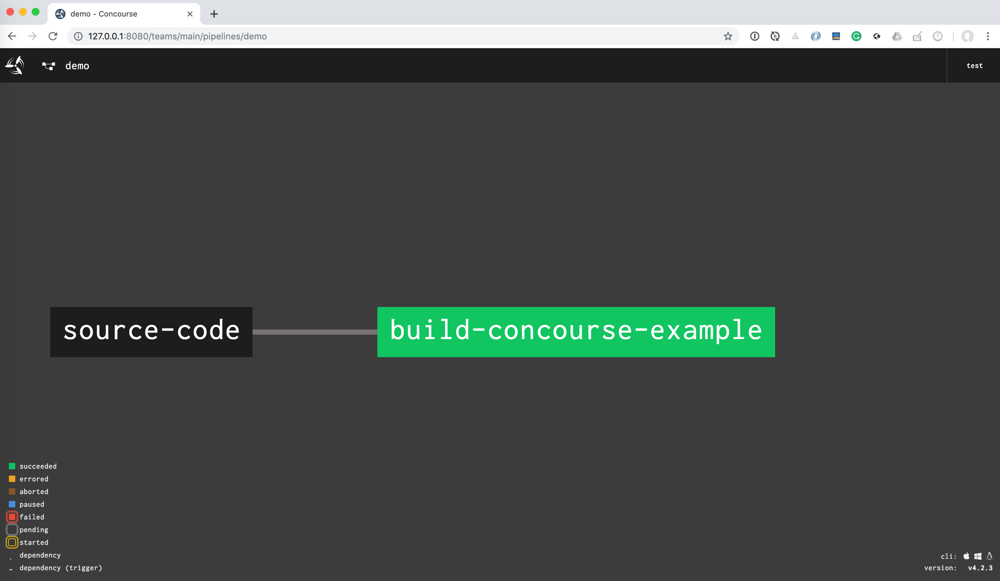
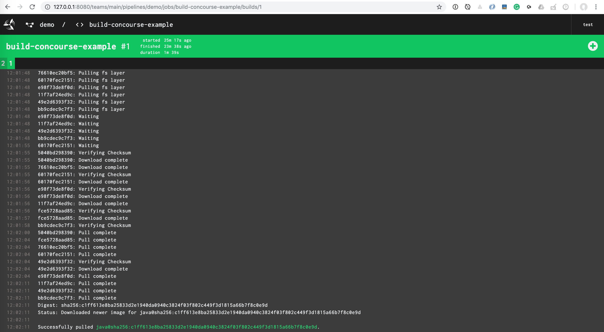
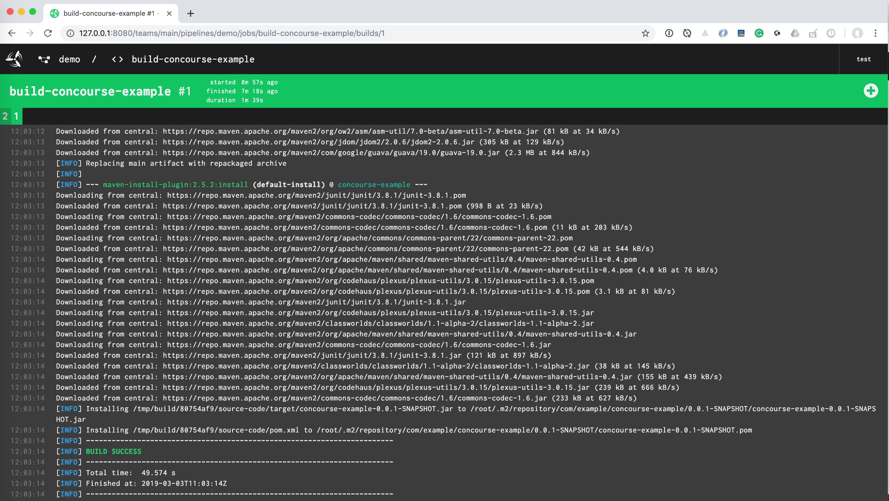
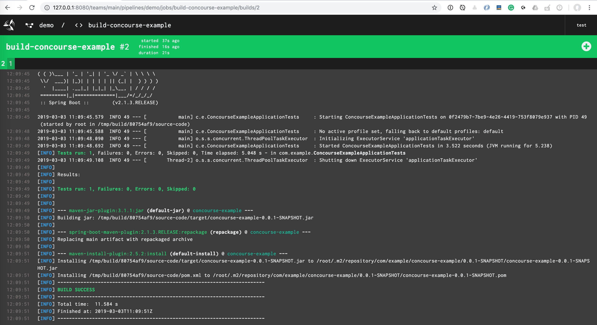

A simple example using [Concourse CI](https://concourse-ci.org/) with Maven cache: 

Start Concourse locally:

```bash
wget https://concourse-ci.org/docker-compose.yml
docker-compose up
```

Install Concourse CLI:

```bash
brew cask install fly
```

Login to Concourse:

```bash
fly -t ci login --concourse-url http://127.0.0.1:8080 -u test -p test
```

Set the pipeline and unpause it:

```bash
fly -t ci set-pipeline -p demo -c ci/pipeline.yml
fly -t ci unpause-pipeline -p demo
```



During the very first build it will download the necessary docker images to build the Spring Boot project.



Then it builds up the Maven cache



The `build` task declares the `maven` cache

```yaml
caches:
- path: maven
```

And in the `build.sh` we create a symbolic link `<CURRENT_USER>/.m2` to this `<BUILD_FOLDER>/maven` folder.  

```bash
+ export BUILD_FOLDER=/tmp/build/80754af9
+ BUILD_FOLDER=/tmp/build/80754af9
+ M2_HOME=/root/.m2
+ M2_CACHE=/tmp/build/80754af9/maven
+ echo 'Generating the /.m2 symbolic link for /maven cache'
Generating the /.m2 symbolic link for /maven cache
+ [[ -d /tmp/build/80754af9/maven ]]
+ [[ ! -d /root/.m2 ]]
+ ln -s /tmp/build/80754af9/maven /root/.m2
```

The next time the build is much faster

 

Remove pipelines:
```bash
fly -t ci destroy-pipeline -p demo
```